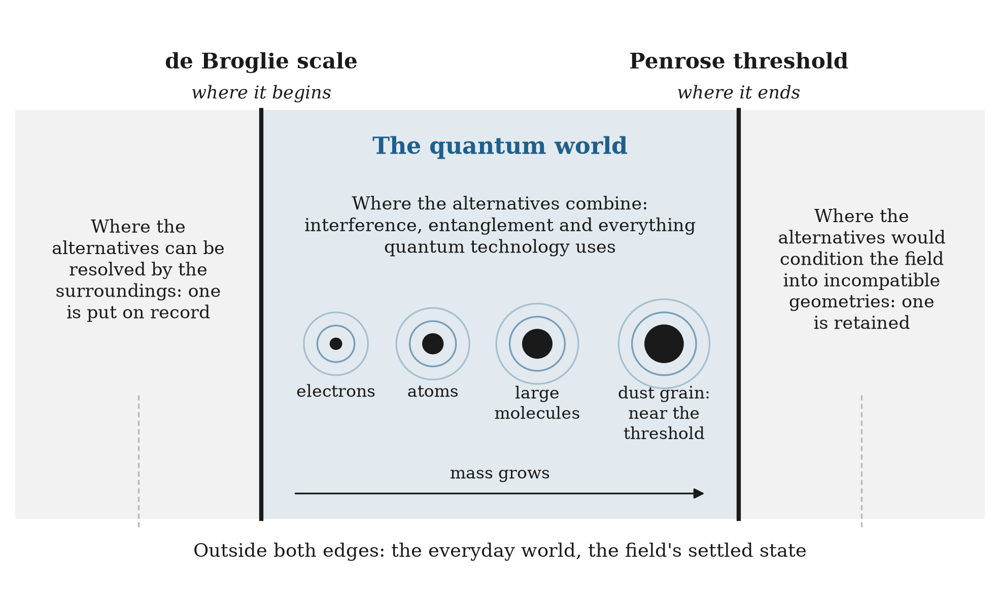

# 23.12 Back to the Everyday World

An account of the small world has to give back the large one. The smooth, definite world of Chapters 18 and 22, where planets move along definite paths through a single geometry, has to return once alternatives stop mattering.

It does, from both directions this chapter has described. Going up in size, objects carry more mass, their de Broglie wavelengths shrink far below any feature they could pass through, and their alternatives come to differ in how they condition the field. Two possible positions of a dust grain would reshape the field in ways no single neighborhood can hold, so one is kept almost at once. Going outward in contact, objects interact constantly with light, air and heat, and each interaction puts the difference between their alternatives on record, as the slit detector did. By the scale of anything we can see, both effects have long since done their work, and a single effective geometry describes everything. The smooth world is the field's settled state.

**Figure 23.3.** The two edges of the quantum world are now in view.

The two edges of the quantum world are now in view. It begins where an object's alternatives are finer than anything around it can resolve: the de Broglie scale. It ends where those alternatives would condition the field into incompatible geometries: the Penrose threshold. Between them lies everything quantum technology uses. And outside them lies the world we live in, which is what the field looks like once it has settled.
