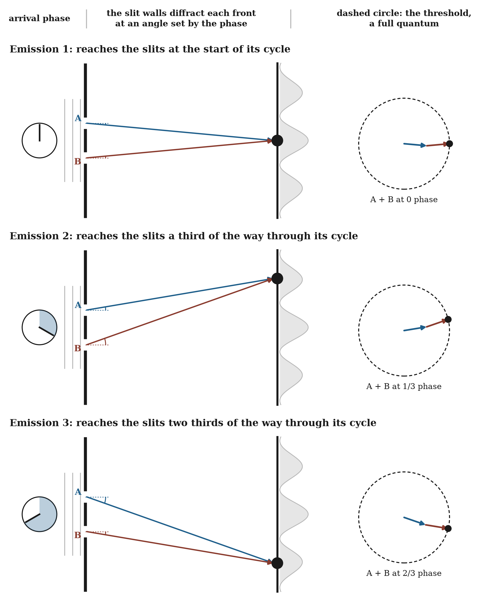

# 23.17 Why the Dots Land Where They Do

The localization mechanism of 23.9 explains why each trial ends in a single dot. It does not yet explain why the dots fall with the frequencies they do.

In standard quantum mechanics the frequencies are given by the Born rule: the probability of an outcome at a point is the squared size of the amplitude there, often written |ψ|². The rule fits every experiment ever done. It is also stipulated rather than derived.

The framework cannot simply rename |ψ|² as "relational density" and declare success. It must show how the field's organization before detection, together with the state of the detector, decides where each excitation starts, and why repeated trials converge on exactly the Born frequencies, not merely on more dots where the field is stronger. The picture in 23.10 gives the target: excitations start and grow where the field's parts reinforce, and fail where they negate each other, and the strength of the combined field at each point is the square of its combined amplitude, which is the Born rule. John Cramer's transactional interpretation gives the same form from the two-ended reading of 23.9: an emitter's forward wave and the absorber's backward echo combine, and the strength of the completed exchange is their product, exactly the squared amplitude. Neither is yet a mechanism; each states the form the frequencies must take. The framework's proposed mechanism follows.

◌ The field passes through both slits and recombines across the screen. Wave optics fixes where the bright stripes lie over many emissions; the proposal here concerns which stripe a single emission chooses, which standard quantum mechanics leaves to chance. The detector registers only a full quantum of energy, so the partial amplitudes spread across the stripes do not register on their own. Where the wave's sideways extent meets the walls of each slit, it diffracts. Each emission reaches the slits at a different point in its cycle, measured against the detector's answering wave, and that relative phase sets the angle at which its front diffracts from the walls. Standard quantum mechanics treats the overall phase of a single emission as unobservable; a phase measured between the two ends of one interaction can be physical. The diffraction steers the recombined front, together with the detector's answering wave, to gather the whole quantum at one bright stripe. Which stripe varies with the relative phase. On this account the Born frequencies are not a separate chance: over many trials, the share of relative phases that steers to each stripe must equal the squared combined amplitude there, the form that both 23.10 and Cramer's product require. Showing that it does is the burden this section names.

**Figure 23.4.** ◌ Three emissions reach the slits at different points in their cycle, measured against the detector's answering wave. That relative phase sets the angle at which the walls of each slit diffract the front, which steers the recombined parts to a different bright stripe each time. At the chosen stripe the parts from A and B arrive in sync, so together they reach the detector's threshold of a full quantum and one dot registers. Over many emissions, how often each stripe is chosen must match its brightness.

That gives a clear division of labor. Interference constrains how the field's parts combine before an outcome. Detector statistics constrain the rule by which a local excitation starts and grows. Conservation constrains the whole reorganization. And varying the measurement coupling shows which features of the mechanism are general and which belong to one apparatus.
